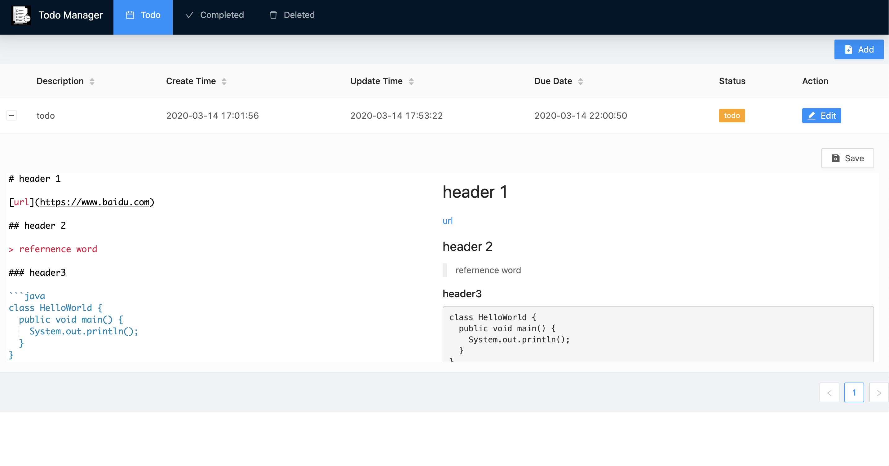

# todo umi project

## Getting Started

Install dependencies

```bash
$ yarn
```

Start the dev server

```bash
$ yarn start
```

## Display

<div align="center">
  
</div>

## Author

👤 **Zhihao Zhang**

- Github: [@zzh1991](https://github.com/zzh1991)

## Show your support

Please ⭐️ this repository if this project helped you!

## 📝 License

Copyright © 2019 [zzh1991](https://github.com/zzh1991).<br />
This project is [MIT](https://github.com/zzh1991/todo-umi/blob/master/LICENSE) licensed.
